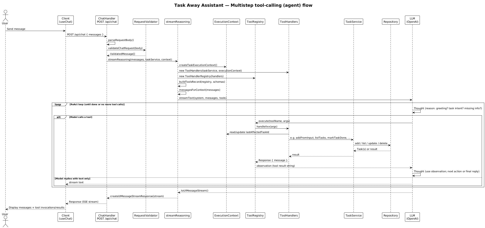
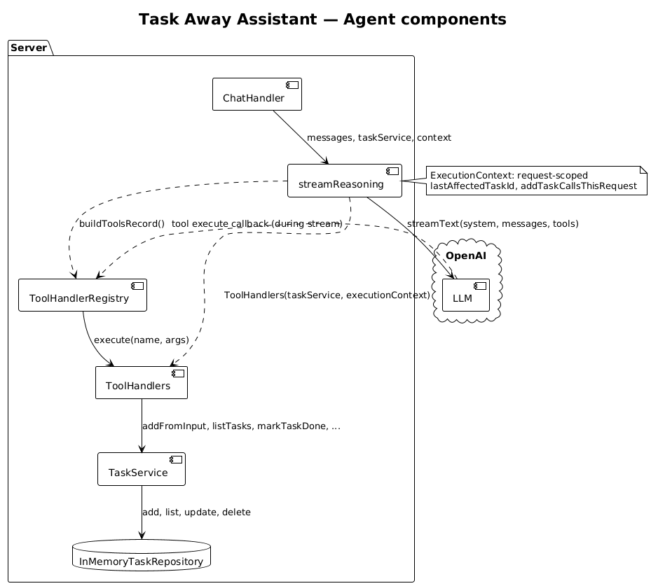

# Task Away Assistant

AI-powered chat-based task manager built on TanStack Start.

## Stack

- **Runtime**: TanStack Start (React, Vite, Nitro)
- **Language**: TypeScript end-to-end
- **UI**: Tailwind CSS, Radix UI primitives, custom CSS
- **AI**: Vercel AI SDK (streaming + tool calling, ReAct-style prompts)
- **Data**: In-memory store behind a repository abstraction (swap for SQLite/DB in production)

## Development

```bash
npm install
cp .env.example .env
npm run dev
```

**Secrets:** Set `OPENAI_API_KEY` in `.env` ([get key](https://platform.openai.com/api-keys)). Server-only; never sent to the client.


## Agency

The assistant is a **ReAct agent**: it reasons (thought), calls tools (action), and uses tool results (observation) in a loop until the task is done—agency level is multistep tool-calling, not single-turn Q&A.

**Multistep tool-calling (sequence):**



**Components (ChatHandler, streamReasoning, LLM, ToolHandlers, TaskService):**



Source: [`docs/agency.puml`](docs/agency.puml), [`docs/agency-components.puml`](docs/agency-components.puml)

## Architecture

- **domain**: Core models and interfaces (no framework code)
- **application**: Use cases, AI reasoning, and task orchestration
- **infrastructure**: Persistence, HTTP, logging
- **components**: Reusable UI (layout, chat, tasks, primitives)
- **routes**: TanStack route files that compose UI + application layer
- **styles**: Global and design tokens
- **server**: API routes and request handlers (Nitro)

### Directory Structure

```
src/
├── domain/                 # Core business logic (no framework dependencies)
│   └── task/
│       ├── task.ts              # Domain entity
│       ├── task-repository.ts   # Repository interface
│       ├── task-commands.ts     # Commands/queries (Zod schemas)
│       └── index.ts
│
├── application/
│   ├── ai/                      # AI configuration and streaming
│   │   ├── ai-config.ts         # System prompts, ReAct/CoT workflow
│   │   ├── task-config.ts       # Task defaults, limits, messages
│   │   ├── reasoning-service.ts # streamReasoning, tool wiring
│   │   ├── tool-schemas.ts      # Zod schemas for tools
│   │   ├── types.ts
│   │   ├── intent.ts
│   │   ├── config.ts
│   │   └── index.ts
│   └── tasks/                   # Task use cases and tool execution
│       ├── task-service.ts      # Main service
│       ├── *-use-case.ts        # Use cases (add, list, mark done, etc.)
│       ├── task-finder.ts       # Resolve by id/title, ambiguity
│       ├── task-formatter.ts
│       ├── task-identifier-config.ts   # Pronoun handling
│       ├── execution-context.ts # Request-scoped (e.g. last affected task)
│       ├── tool-handlers.ts      # Tool implementation + guardrails
│       ├── tool-handler-registry.ts
│       └── index.ts
│
├── infrastructure/
│   ├── http/
│   │   ├── http-constants.ts
│   │   ├── request-validator.ts
│   │   ├── response-builder.ts
│   │   └── index.ts
│   ├── task/
│   │   ├── in-memory-task-repository.ts
│   │   └── index.ts
│   └── logger.ts
│
├── components/
│   ├── layout/             # AppShell
│   ├── chat/               # ChatPanel
│   ├── tasks/              # TasksPanel
│   ├── ui/                 # Button, input, dialog, etc. (Radix-based)
│   └── ai-elements/        # Conversation, message, prompt-input
│
├── routes/
│   ├── __root.tsx
│   └── index.tsx
│
├── styles/
│   ├── globals.css
│   ├── reset.css
│   └── tokens.css
│
├── lib/
│   └── utils.ts
│
├── router.tsx
├── routeTree.gen.ts
└── styles.css
```

```
server/                      # Nitro API and handlers
├── api/
│   ├── chat.post.ts         # POST /api/chat (streaming)
│   ├── tasks.get.ts         # GET /api/tasks
│   └── handlers/
│       ├── chat-handler.ts
│       └── tasks-handler.ts
└── task-context.ts          # Singleton TaskService for server
```
